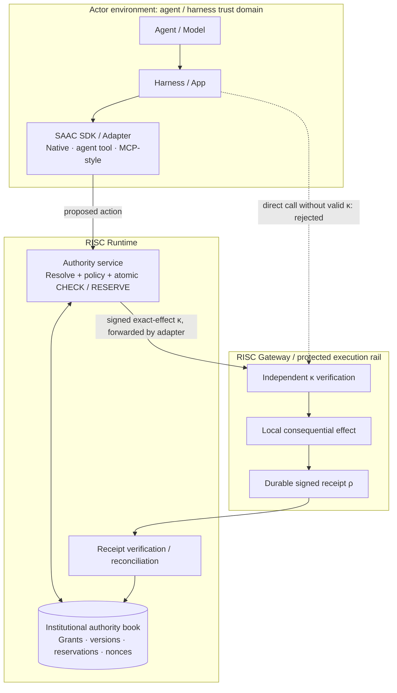

# Agentic RISC · Govern The Rail Lab

**The actor proposes. The RISC Runtime authorizes. The RISC Gateway enforces.**

**[Explore the live demo](https://govern-the-rail.onrender.com/)** — no account
needed. Free hosting may take about a minute to wake up after inactivity.

A local reference demo for Ian Byer’s practitioner-led *Agentic RISC* architecture.
Independent institutional controls permit agents to choose actions without
choosing their own limits. Payments, trading, synthetic patient referrals, contained scripts and
incident/swarm scenarios use **one Runtime/Gateway core with domain packs**. All effects are
local fixtures; no real funds, patient data, cloud credentials or model API are used.

**Adapters may live in the harness. Authority lives outside the agent trust boundary.**

For a public sandbox, the included [Render deployment](docs/PUBLIC_DEMO.md#render-free-hosting)
runs on one free service with isolated 30-minute visitor sessions. Hosting storage
is temporary; export results you want to keep.

## Run locally

Requires Python 3.11+, Node 20.19+ (22 recommended), npm and Make.

```bash
git clone https://github.com/ianbyerdev/govern-the-rail.git
cd govern-the-rail
make demo                # install, build, serve at http://127.0.0.1:8000
make test                # backend, API, security and actual concurrent races
make test-ui             # Chromium desktop/mobile end-to-end tests
make actor               # separate actor-only HTTP client
```

Open the demo and click **Start demo**. You receive your own temporary workspace,
with no account or credential to copy. It lasts 60 minutes; export any evidence
you want to keep before ending it. Every agent in an experiment shares its book.
Other visitors and the host have separate storage and keys.

The launcher also prints an **administrator** link for the host's persistent
experiments and real contained-process tests. Keep that credential separate from
actor tools and public visitors. It can also be entered under **Administrator
access** on the landing page. Administrator history persists in `.runtime/`;
temporary visitor data is cleaned up after expiry. **Fresh experiment** preserves
earlier evidence within the current workspace. Actors cannot create books or
reset their limits.

Public sessions cap campaigns at 100 logical actors, limit resource usage and
disable real subprocess execution. The administrator retains the larger and
contained-process demonstrations. See [public hosting and session boundaries](docs/PUBLIC_DEMO.md)
for HTTPS setup, cleanup, quotas and configuration.

The fixed contained-script and worker proofs additionally require Linux,
Bubblewrap and `/usr/bin/python3` (`sudo apt-get install bubblewrap python3` on
Debian/Ubuntu). If containment is unavailable they fail closed. Other domain
scenarios and logical swarms work without it. For missing Chromium OS libraries,
run `cd frontend && npx playwright install --with-deps chromium`.

Use `make demo PORT=8001` for another port. For a separate data directory:

```bash
.venv/bin/python scripts/demo.py --data-dir .runtime/fresh --port 8001
```

## Understand the architecture in three minutes



`Authority` and `RiskBook` are the control-plane service abstraction, hosted by
`SAACService` / FastAPI (`saacd` after installation). Agents consult its shared SQLite state, never an independent
copy of remaining capacity. A transaction checks **used + reserved + proposed ≤
limit**, reserves capacity and stores signed κ before returning it.

An **Action Contract** is the linked effect, decision, reservation where needed,
executable capability and accepted outcome lifecycle. It is not a fourth service.
Existing `saac` package names, commands, API identifiers and signed artifact types
remain compatible; reader-facing architecture labels do not rewrite historical tapes.

κ binds a unique capability ID and nonce, principal/agent, grant lineage, exact
canonical effect and parameters, policy hash, relevant state versions,
reservation, audience and expiry. An ALLOW verdict alone cannot execute anything.
`ProtectedSocket` independently checks the issuer's **public** key, live
reservation, expiry, audience, identity, unused nonce, live policy/grants and
re-resolved exact effect. Only then can its internal rail adapter perform the effect.

ρ binds capability, snapshot, reservation, execution and cumulative outcome. The
accepted socket observer signs it with a separate key. Reconciliation checks both
signature and durable journal, then applies evidence idempotently. **Expiry or a
missing receipt never creates free capacity.** Historical κ/ρ remain readable.

## Try the boundary

Choose **A · Native application**, **B · Agent harness**, or **C · MCP /
plugin-style**. All three reach the same authority and book. Harness and MCP modes are local
simulations, not measured Codex/OpenCode interoperability or a live MCP server.

- **Normal authorized action**: all nine recorded lifecycle stages light up.
  Select any stage to inspect principal, lineage, policy, versions, reservation,
  κ, executor decision, ρ and current authoritative risk.
- **Direct rail bypass**: the same $1,000 payment is rejected without κ, then
  executes with valid authority. Removing the SDK/plugin cannot remove the gate.
- **Policy rejection**, **Replay attack**, **Capability mutation** and **Expired
  capability**: inspect the actual authority/executor refusal. Mutation substitutes
  the beneficiary after issuance. Rejected redemption retains the reservation.
- **Authorization retry**: simulate a lost response. The same request returns
  the same κ and one reservation; a second execution is rejected.
- **Concurrency mode → Naive policy / SAAC atomic authority → Launch 100 concurrent
  requests**: 100 distinct agents each request $100,000 against one $1M book.
  Naive stale checks admit $10M of potential exposure. SAAC issues ten capabilities
  and refuses ninety. Both use real barrier-synchronized threads. The unsafe
  arithmetic never signs κ or executes protected effects. Select an SAAC outcome
  square to inspect that agent's evidence.
- **Delegation violation**: a $10K parent narrows to $2K/$3K children, a child with
  no mutation authority, and an Acme-only child. Valid payments execute; oversized
  payments, mutation, another beneficiary and re-delegation expansion fail.
  Ceilings are per effect; descendants still share the aggregate book.

The existing detailed workflows remain: manual review and κ/ρ steps, lost-receipt
recovery, OMS fills and separately authorized cancellation, sealed referral
manifests and consent changes, contained jobs, and the **Incident / Swarm Lab**.
The latter retains its source-labeled counterfactuals, 100/1,200/5,000 logical actors
and separate 2–8-process containment proof.

The dashboard also includes **A missing receipt does not create capacity**: a
matched experiment where both policies atomically admit 10 of 100 requests, but
an intentionally incorrect timeout release lets a second batch raise modeled
obligations to 20 against a ceiling of 10. Follow the steps through withheld fill
receipts and confirmed cancellation, or run the comparison in one click.
See the [experiment guide and local reproduction](docs/UNCERTAIN_EXECUTION.md).
`make reproduce-uncertain` generates verified evidence and runs both test suites.

Choose **Coverage schedules C8–C10** for the v3.9 extensions: independent rail
persistence across an actual Runtime process restart, parent revocation while a
child occupies capacity, and two books sharing one downstream allocation. Each
run executes a fixed backend schedule; **Step replay** then inspects its captured
checkpoints. The dashboard separates local ledger compliance, obligation coverage,
the true shared ceiling, ordinary conformance, and detection of deliberately unsafe
controls. No observed values are displayed before execution. A clean source
observation identifies its source commit; an uncommitted run stays labeled unpinned.
The historical C1–C7 pin and test counts remain historical.

`make reproduce-coverage` executes all three schedules and their checks. See the
[coverage reproduction and evidence guide](docs/COVERAGE_SCHEDULES.md) for individual
commands, evidence contents and limits. C8 runs only under the local operator
profile. Public sessions support bounded C9/C10 schedules with existing isolation,
book quotas and heavy-job controls; hosted C8 process execution is unsupported.

## Integrate an application

`saac/sdk.py` contains no policy engine, ledger, signing key or effect implementation.
Use an actor credential with `HTTPTransport`; never pass the trusted service object
or operator credential to an untrusted harness.

```python
import os
import httpx
from saac.sdk import SAACClient, HTTPTransport, Identity
from saac.adapters import NativeApplication, AgentHarness, MCPAdapter

with httpx.Client(base_url="http://127.0.0.1:8000",
                  headers={"Authorization": "Bearer " + os.environ["SAAC_ACTOR_TOKEN"]}) as http:
    sdk = SAACClient(HTTPTransport(http), Identity())
    run = NativeApplication(sdk).propose(
        {"amount_cents": 7500, "beneficiary": "acme"}, request_id="invoice-123")
    # Alternative: AgentHarness(sdk).propose({"name": "propose_action", "arguments": {...}})
    # Alternative: MCPAdapter(sdk).call_tool("saac.propose", {"intent": {...}})["structuredContent"]
    if "kappa" in run:
        result = sdk.execute(run.get("execution_proposal", run["proposal"]), run["kappa"])
        if result["accepted"]:
            sdk.reconcile(result["receipt"])
```

Persist one `request_id` before the first authorization call and reuse it after a
lost response. Omission means a new logical request. HTTP callers send it as
`Idempotency-Key`; native, harness and MCP wrappers forward it unchanged. The
authority binds it to authenticated identity and canonical effect, and stores it
atomically with the reservation. It never refreshes an old κ.

The HTTP profile exposes `/api/proposals`, `/api/rail/execute` and `/api/receipts`
for the registered payment actor. Existing run-ID convenience APIs remain.
The workbench exercises every domain through the same SDK with trusted in-process
transport; swarm actors use their existing campaign-bound HTTP channels. The
separate CLI supports `--integration native`, `harness` or `mcp`:

```bash
SAAC_ACTOR_TOKEN="$(cat .runtime/actor.token)" .venv/bin/python -m saac.actor --integration mcp
```

## Boundaries and demo shortcuts

The original domain profiles keep Runtime and Gateway modules/key roles in one
trusted service with shared SQLite transactions. C8 additionally exercises separate
same-host processes and independent stores; it does not establish remote production
exchange behavior or host compromise resistance. The dashboard is an institutional operator. Local
same-user development does not protect keys/database files from arbitrary code
running as your OS user. The existing optional container setup isolates the actor
UID/filesystem and mounts only its actor credential:

```bash
docker compose up --build -d risk
docker compose --profile actor run --rm actor
```

Stop the local server first if using the same port. Compose does not enable nested
Bubblewrap; use Linux local mode for contained-script experiments. See the
[threat model](docs/THREAT_MODEL.md) for the full boundary.

**Hashing a shell command does not establish its semantic effects.** The runtime
pack authorizes only a fixed contained job. Code hashes bind its identity.
Consequential API effects have their own typed resolver and protected gate; the
fixed swarm workers demonstrate that route through supervisor-bound proposals.
There is no arbitrary shell capability or host-shell fallback.

Real remote rails would need durable idempotent execution/redemption protocols,
independent service identities and least-privilege credentials, protected keys,
strongly consistent recovery, and externally anchored audit. This fixture uses
local effects and an unanchored hash chain; it is not production certification.

## Package and protocol

SAAC means **Shared Agent Authority Contract**. The Python package is `saac`,
the distribution is `saac-reference`, and the installed commands are `saacd` and
`saac-actor`. Integrations use `SAACClient`, `saac.*` tools and `SAAC_*`
configuration.

The wire format is independently identified by `saac_version: "0.3.0"`.
Capabilities and receipts use the signed types `saac-kappa` and `saac-receipt`.
Policy and resource versions track live authority state inside each experiment.

## Further reading

Start with the [documentation index](docs/README.md) for architecture, guides,
validation and hosting details.

- [Public demo entry, isolation and internet hosting](docs/PUBLIC_DEMO.md)
- [Architecture and transaction boundaries](docs/ARCHITECTURE.md)
- [Detailed domain walkthrough](docs/DEMO_GUIDE.md) · [Swarm walkthrough](docs/SWARM_DEMO_GUIDE.md)
- [Specification](docs/SPEC.md) · [Validation and benchmarks](docs/VALIDATION.md)

Export **Inspect bindings… → Verify complete tape → Export tape**, then verify offline:

```bash
.venv/bin/python -m saac.tape path/to/saac-tape.json
# Add --expected-head sha256:... to compare with an independently retained head.
```

Software and fixture documentation: [MIT](LICENSE). The paper is a separate work.
