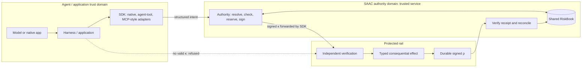
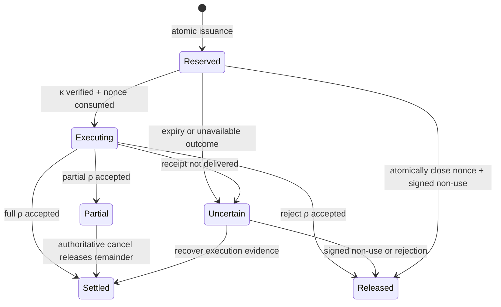
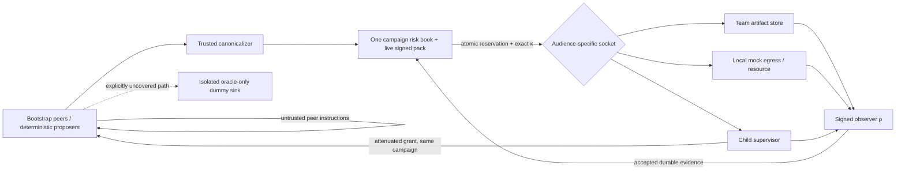

# Architecture

The agent proposes. SAAC authorizes. The rail enforces.
Adapters may live in the harness. Authority lives outside the agent trust boundary.

The public **Govern The Rail Lab** entry wraps these components in temporary
visitor workspaces. An opaque, scoped session cookie selects server-owned stores;
it does not grant host administrator access or replace κ. Public and administrator
routes register the same domain handlers with different store dependencies. Each
experiment retains one shared authority book for all of its agents. See
[PUBLIC_DEMO.md](PUBLIC_DEMO.md) for lifecycle, quotas and deployment boundaries.

## Integration boundary

`SAACService` is the local authority host; `saacd` is its lightweight launcher.
Artifact verification in `protocol.py` requires the exact signed type and checks
the original bytes. Receipt types cannot substitute for capability types.

Authorization requests carry a durable `request_id` (HTTP `Idempotency-Key`).
The authenticated principal, agent, grant, preview/commit mode and identifier
define its scope. Lookup, canonical-effect comparison and the original
CHECK + RESERVE + issuance share one SQLite write transaction. Retries return
the stored run/κ; an `AUTHORIZATION_REPLAYED` event records that no allocation
was added. Informational harness/model identifiers cannot create another
reservation. Equivalent aliases are resolved by the authority. Changed effects
conflict. A byte-equivalent semantic candidate can recover its original artifact
after state changes, but the executor still rejects stale, expired, revoked or
consumed authority. A preview cannot be mistaken for a committed authorization.

`Authority` + `RiskBook` form the service abstraction; there is no
second issuer hidden in an adapter. `sdk.py` structures requests; `adapters.py`
offers native application, agent-tool proposal and MCP-style tools/list/tools/call
interfaces. `ServiceTransport` is exclusively trusted operator/test wiring.
Separate actor processes use `HTTPTransport`, which exposes no policy controls,
private keys or database handles. The MCP shape is not an MCP wire server.

`POST /api/rail/execute` accepts the actual proposal and κ. Transport credentials
establish actor identity but do not authorize the effect. Missing or malformed κ,
and boolean verdicts, receive a structured refusal. Actor identity is independently
checked by the server even if all SDK checks are removed. `POST /api/receipts`
accepts signed durable evidence; execution and reconciliation are separate steps.
Run-ID convenience endpoints still invoke the same verifying socket.

Capabilities include a signed `kappa_id`, distinct from the nonce. Receipts bind
both. Redemption explicitly checks live
reservation status and unspent bounds in every budget dimension.

The dashboard's integration selector invokes the actual corresponding adapter.
Its nine-stage lifecycle is derived from committed events, not animation timers.
Stage details distinguish historical event/version data from current reservation
and risk state. Missing stages remain unlit; queued job dispatch is not a completed
job. The payment reference scenarios in `demonstrations.py` compose the core's
public operations and never implement policy or cryptography themselves.

The payment race bootstraps 100 distinct institutional identities sharing one
session. A 100-thread barrier releases concurrent $100,000 requests against $1M.
Ten obtain κ; ninety fail admission. The selectable naive mode performs only the
separate unsafe arithmetic, issuing no κ and touching no protected effect table.
Its comparison is logged with explicit provenance. Domain races and incident campaign/containment workflows exercise the same core.

The delegation reference uses the existing payments pack: a $10,000 parent,
$2,000/$3,000 children, a child with no mutation operations, and an Acme-only
child. A resource allowlist demonstrates the same narrowing principle as
staging-versus-production without inventing a new deployment rail. Child ceilings
are per-effect authority; they do not create independent aggregate balances.

For scripting, code identity and semantic authorization are distinct. The fixed
audit job's hash seals code, not a proof of all possible downstream effects.
`swarm_worker.py` sends typed proposals on a supervisor-bound channel; each goes
through canonical resource resolution, issuance and independent socket enforcement.
No generic shell-command string is treated as proof of payment, egress or mutation
semantics. The fixed workers and host containment remain part of the stated scope.

The current specification is [SPEC.md](SPEC.md); see the
[documentation index](README.md) for guides and validation details.
The app contains three responsibilities: actor proposal, institutional authority,
and consequential socket enforcement. A model can be replaced by implementing
`actor.Proposer`; none of the authority code depends on model internals.

## Process and credential boundaries

`python -m saac.actor` runs a separate process that knows only its actor credential
and the typed HTTP interface. The risk service owns the database, resolver,
pack signing and execution-evidence keys. Actor identity is bound to
`agent.demo / institution.demo / G-DEMO` by the HTTP role check. Operator controls
use a distinct generated credential. The frontend is the operator console, not a
model tool. It may inspect policy and deliberately change trusted state.

Core functions are directly available to unit tests. This does not imply they
are exposed to actor clients. In local development the OS user remains trusted;
Compose strengthens the filesystem boundary with separate UIDs and mounts.
Risk issuer and protected socket share a trusted process but have separate modules
and key roles. Compromise of that service is outside this toy's security claim.

## Exact objects

`Effect(p,s,o,r,x,c)` implements equation (1). Monetary values are strict positive
integer cents, with no floating point in signed JSON. Canonical encoding uses
UTF-8, sorted keys, compact separators, JSON booleans/null and SHA-256. A profile
implementation in another language must reproduce those bytes exactly; this is
not a claim of general JSON Canonicalization Scheme conformance.

Aliases are normalized NFKC + whitespace trim + casefold and looked up in the
institutional resolver. `c` includes resource, route, sanctions, grant and schema
versions plus the pack hash. Time inputs and observed state are retained in the
snapshot/evaluation record. A resolved resource denotes an account; UI nicknames
are never the account authority. Current bindings are checked again at the socket.

The snapshot binds provenance, the identity/resource/pack fields,
completeness commitment and a single-use nonce. κ additionally contains the exact
effect for legibility, as well as H(e), snapshot hash and reservation metadata.

## Atomic authority

Every risk mutation uses its own SQLite connection and `BEGIN IMMEDIATE`.
SQLite WAL permits independent readers; write transitions serialize. The issuer:

1. Resolves a complete proposal using the institution's current tables.
2. Checks the grant and ancestry and evaluates the deterministic pack.
3. Holds the write transaction while rechecking current state/capacity.
4. On allow/attenuating modify inserts reservation and nonce and signs/stores κ.
5. Commits the whole transition before returning κ to the caller.

`U = SUM(reservations.consumed)` and
`Q = SUM(bound - consumed - released)` are derived from the ledger, not writable
actor counters. Every admission requires U+Q+b(e) ≤ L. Signing/commit failure
rolls back the entire transition. A committed response lost in transit can strand
Q but cannot leave usable unreserved authority. Policy updates cannot lower L
below existing U+Q. The actor cannot choose a different session to evade L.

The evaluator is pure, and its allow result has no credential semantics. The
fixture deliberately evaluates inside the serialized transaction for simplicity;
the paper permits speculative parallel evaluation with a serialized recheck.

## Socket and TOCTOU boundary

The socket verifies the signature against a public issuer key, then checks the
stored reservation, audience, time, represented identity, grant, single-use nonce,
live signed pack, breaker, current resolver commitment, H(e) and snapshot hash.
All are checked on the authoritative side. No API field says `approved=true`.

Nonce consumption, final liveness checks, local payment row, execution record
and signed receipt commit in one transaction. Policy publication and resolver
updates cannot intervene between the final check and this toy effect. The socket
has a `Rail` protocol; payment-specific execution lives in `PaymentRail`.
`ScopedDispatch` is the mediated control-plane effect used to demonstrate child
grants. Unknown adapters fail closed; there is no shell or raw-spawn fallback.

A malformed or tampered invocation has no authority to release someone else's
reservation. The caller can retry the original exact effect. A genuine rail
rejection produces accepted, terminal, signed release evidence.

## Reservation state machine

Settled after partial cancellation means the executed part remains U and the
unused remainder is released. Risk is never improved by an actor's claim.

Receipts use cumulative consumed/released/remaining and a per-execution revision.
The consumer validates signature, reservation/snapshot/nonce/audience/execution
bindings, nonnegative integer conservation and monotonic cumulative amounts.
A higher revision may arrive first. Lower/duplicate revisions then change nothing.
Conflicting equal revisions are rejected; a terminal reservation cannot reopen.

When ρ is lost the socket ledger knows what happened, but risk remains reserved.
Reconciliation retrieves durable evidence. If there is no execution, the accepted
socket observer proves non-use by closing the unused nonce under the same lock
and issuing a signed receipt. A timer alone does neither. This is how the fixture
models safe relief without assuming a missing receipt means failure.

## Approval, modify, delegation and degrade

Pending human approvals store an immutable snapshot and hash, with expiry, but
no reservation. Approval is a one-time operator decision on that snapshot. Live
pack/resource/grant/capacity are rechecked before issuing κ. The approval panel's
only actionable content is the resolved snapshot. After approval, changing amount,
beneficiary or route still fails exact-effect binding.

Modify can only lower amount, leaving every other effect dimension unchanged;
issuance reserves the recomputed bound. Degrade rewrites the root grant to empty
operations and increments its version; independent restoration increments again.
Children bound to the old parent version fail liveness. Delegation checks all scope
sets, amount, expiry, principal and depth and retains the parent's session ID.
The fixture exercises child actions from the operator console; the separate mock
actor's credential remains bound to its original identity and cannot impersonate
that child. A real child harness would need independently provisioned identity.

## Tape and experiments

Tape records have monotonic sequence, timestamp, run ID, structured data and a
hash of the previous record. Replay verifies deterministic decisions, signed packs,
κ/ρ, reservation order, conservation and admission counters against reconstructed
ledger state. Export contains only public keys. Passing a retained head to the
verifier detects truncation relative to that head. No external anchor is provided.

Each lab case owns a fresh database and keys under `.runtime/labs/`. The race uses
100 real threads with a barrier, independent SQLite connections and one shared
collar. The unsafe contrast uses separate in-memory state, observes a counter
before the barrier and updates afterward. It has no signer or socket path.

## Four-domain workspace

The `workbench.py` operator API composes the **same** Authority, ProtectedSocket,
RiskBook, Reconciler and tape verifier for every domain. It does not emulate
issuance in the browser. Strict models in `domain_models.py` select trusted
`profiles.py` resolution/evaluation and `domain_rails.py` effect adapters.

Each explicit experiment is a persisted book with separate keys and a fixed
session. Only the operator can create/select these books. They represent distinct
research experiments, not spendable partitions an actor can create to evade an
institution's collar. Production cross-rail institutional netting is not modeled.

Payments use a scalar amount representation. Other profiles use the
`allocations` table for named integer dimensions. All
admission and settlement mutations share one SQLite write transaction.
The scalar reservation columns mirror the first sorted dimension only for the
payment record shape; **all** dimensions are authoritative in allocations and are
checked and replayed. Profile limits cannot change dimension identities while
retained signed history exists.

- OMS admission creates a durable working order and no fill. The local EMS can
  progress only that order, within quantity and price bounds, under a write lock.
  Cumulative fill evidence accounts for actual prices and releases proven price
  improvement. A separately mediated cancel targets an owned order version. A
  concurrent fill either precedes cancellation and stales its capability, or
  follows confirmed cancellation and is refused. Pack updates do not erase live
  orders or refuse valid historical outcome evidence.
- Referral resolution hashes the exact synthetic bytes and orders the manifest.
  The socket resolves again under the same transaction that transfers those bytes
  into the synthetic recipient inbox. Consent, patient and directory commitments
  cannot drift between this check and the local disclosure. Records and bytes
  count permanently once the receipt is accepted.
- Runtime admission commits a durable intent. At launch claim, the trusted runner
  rechecks κ, expiry, live signed pack, grant, breaker and effect bindings under
  the claim lock. It seals the fixed script bytes, records one irreversible claim,
  then starts Bubblewrap outside the database transaction. This is the dispatch
  acceptance point; later institutional changes do not undo an already claimed
  job. The child sees read-only runtime/script mounts and a scratch workspace,
  no risk database or keys, and its own network/PID/user/mount namespaces.

The trusted supervisor observes exit, fsyncs a signed job-bound journal outside
the child mounts and converts that evidence into a versioned ρ. Slot capacity is
released only when R accepts exit evidence; starts remain consumed. A queued
unclaimed intent can be atomically closed with non-use evidence, racing safely
with launch claim. A claimed job with no journal remains uncertain and is never
automatically launched again. This trades availability for prevention of duplicate
consequential execution. It is not a general distributed exactly-once protocol.

The profile's local receipt observer is registered by the service's audience and
public key. Reconciliation additionally requires the receipt to match its durable
socket journal; an unrecorded signed payload is not execution evidence in this
fixture. The UI exposes current versus accepted receipt revisions separately.

## Incident / Swarm Lab

`saac/swarm` extends the same Authority, RiskBook, ProtectedSocket, Reconciler and
signature/tape implementation. It does not simulate the security checks in the browser.
The scenarios are described in the [swarm walkthrough](SWARM_DEMO_GUIDE.md).

Each audience has a separate receipt key and accepted-observer registry. A valid
signature from another socket is insufficient, even if that socket shares the
institution. The reconciler additionally checks its durable socket journal.
The campaign uses integer dimensions `messages`, `read_bytes`, `disclosed_bytes`,
`agent_starts` and `agent_slots`. Transactional `campaign_totals` is a materialized
projection maintained alongside allocation writes; export verifies it against
all allocations, then replays every admission and settlement from the tape.

Only the operator bootstraps a campaign or creates fresh comparison books. Actor
HTTP credentials are hashed in `swarm_channels` and bound to one registered actor
and one campaign. Actor JSON cannot select another identity, principal, grant or
session. Child scopes are checked in every authority dimension, retain ancestry
and share the campaign collar. Per-effect ceilings are not subtree allocations.

Logical child starts are atomic local state transitions: start ρ consumes one
lifetime start but leaves one slot held. Separately authorized stop produces
cumulative exit evidence; only reconciliation releases that slot. Real contained
workers instead commit a queued intent, claim launch once, revalidate live state,
run a sealed fixed script in Bubblewrap and fsync a signed exit journal. A claim
without a journal is uncertain and is never automatically relaunched.

The persisted scheduler has replay, reactive and bounded concurrent modes.
Idempotency key + request hash + proposal/κ commit in the same issuance transaction.
On resume a durable execution is reconciled, never performed again. A filesystem
lock excludes another scheduler for the same campaign. Processes that die mid-batch
leave pending intents recoverable. HTTP summaries use read transactions and return
small totals; the Canvas population uses one status character per actor. Artifacts
and event bodies load on demand; event cursors are append-only sequence numbers.
Play/pause controls stop scheduling after the current bounded batch, not mid-effect.
