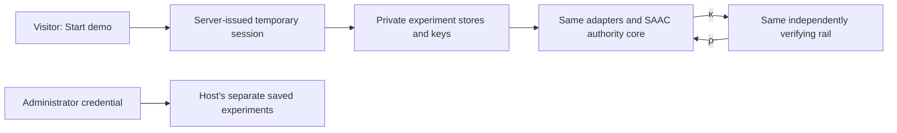

# Govern The Rail Lab: public demo hosting

Visitors open `/` and choose **Start demo**. No account, API key or copied
credential is required. The server creates a private, temporary workspace and
sets an opaque `HttpOnly`, `SameSite=Strict` session cookie scoped to `/api/demo`.
On HTTPS it is also `Secure`. Only its hash is stored in the session registry.
No administrator token or signing key is returned to a visitor.

## What a visitor can do

Payments, trading, synthetic referrals, capability attacks, delegation and the
100-agent concurrency scenarios use the existing SAAC core and domain handlers.
The visitor plays the institution in their own synthetic experiment: they may
change its pack or pause its grants. Those changes cannot affect the host's
administrator workspace or another visitor's workspace.

Every agent in an experiment still shares **one authoritative capacity book**.
The session cookie selects a workspace; it is not κ and cannot authorize a
protected effect. Capabilities and receipts retain their independent signatures,
exact-effect checks, expiry, nonce consumption and reconciliation.



The native, harness and MCP-shaped choices remain local simulations. Public
swarm actors are logical actors, with actual bounded concurrent requests where
the scenario calls for concurrency. Public access cannot launch the contained
Python workers or fixed runtime jobs. Job authorization, scope narrowing and
unsigned-rail refusal remain inspectable; real process tests stay available in
the administrator workspace.

The **Coverage schedules C8–C10** dashboard runs fixed C9/C10 schedules inside
the authenticated visitor's own workspace. It provides observed checkpoint replay
and JSON evidence export. C9 consumes two experiment books; C10 consumes six
across its three independent configurations. They share the existing book and
heavy-job quotas, and each execution consumes one heavy-job allowance. Retrying
the same request identifier returns the same run; it cannot produce a fresh
allowance. Exports acquire a concurrent-work lease without consuming a start.
C8 requires separate Runtime and rail processes and is explicitly unsupported
for public visitors. The local operator can run that fixed fixture. No public
route accepts shell commands, executable paths or process launch options.
These API/browser checks establish bounded visitor behavior locally, not a claim
that the updated code was deployed or tested on a particular hosted provider.

## Sessions and isolation

- Routes under `/api/demo/workbench`, `/api/demo/swarm`, `/api/demo/uncertain`,
  and `/api/demo/coverage` use the same registered
  handlers as the operator dashboard, with a server-selected store dependency.
  A book ID, principal field, query parameter or header cannot select another
  visitor's directory.
- Each visitor's keys, books, campaigns and evidence live below
  `.runtime/visitors/<random-id>/`. The separate session registry stores hashes,
  expiry and quotas. Host experiments remain in their original directories.
- Reloading the page or restarting the server preserves an unexpired session.
  Its absolute lifetime is measured against the host clock. Advancing a scenario's
  simulated clock does not change session lifetime.
- **End demo** revokes access immediately. A cleanup sweep runs every 30 seconds,
  at startup and at session creation/end. Expired work is stopped after its
  current bounded batch. Files are removed only after in-flight requests and
  background jobs release their workspace leases.
- Visitors can export their signed tapes before expiry. Read-only export remains
  available after an action/storage allowance is reached. It still obeys request
  and concurrent-work limits. Temporary public data is not an archival service.

## Default resource bounds

| Resource | Default |
|---|---:|
| Session lifetime | 60 minutes, absolute |
| Active / draining visitor workspaces | 16 per host |
| Session creation | 10 per peer address / 10 minutes; 30 globally / minute |
| Experiment books | 12 per visitor, plus the initial payment book |
| Campaigns | 4 per visitor |
| Actors per public campaign | 100 |
| Swarm/race starts | 12 per visitor |
| Concurrent expensive operations, including tape verification | 2 per host; 1 per visitor |
| In-flight API requests | 8 per visitor |
| Requests | 240 per visitor / minute |
| Mutations | 30 per visitor / minute; 240 per session |
| Request JSON | 32 KiB on API routes |
| Workspace storage admission threshold | 32 MiB |

The storage threshold is checked before admitting a mutation. A single bounded
operation and its SQLite journal can cross that threshold; it is not a filesystem
quota. Use a bounded volume for a hard disk ceiling. Limits return explanatory
errors, and the UI retains the current evidence. Tape exports do not consume a
swarm-start allowance.

## Local use

`make demo` opens the public landing page. Its terminal also prints a separate
administrator link for the host's persistent experiments. To open that view
directly:

```bash
.venv/bin/python scripts/demo.py --operator
```

Administrator access is also available in the collapsed section on the landing
page. It verifies the existing operator credential before opening the workspace.
Actor credentials still cannot access institutional controls. Signing out of the
administrator UI does not delete the host's saved evidence.

## Internet deployment

### Render free hosting

The repository includes [render.yaml](../render.yaml) for one free Docker web
service. In Render, create a **Blueprint**, connect this repository and select
`main`. Review the plan as **Free** before deploying. Render builds the dashboard
and Python service together using the existing Dockerfile; GitHub Actions is not
required for deployment.

You can use the **Public Git Repository** URL without installing Render's GitHub
app. That connection requires manual deploys: open the service and choose
**Manual Deploy → Deploy latest commit** after updating the code. For changes to
`render.yaml`, also run **Manual sync** on the Blueprint. A connected GitHub
integration can enable automatic deploys; scope its repository access to this
demo if you choose to install it.

The startup command uses Render's assigned HTTPS address as `SAAC_PUBLIC_ORIGIN`.
For a custom domain, explicitly set that variable to the exact HTTPS origin you
want visitors to use. The service listens on port 10000 and uses `/api/health`
for health checks. It runs one Python process.

This profile limits the host to four visitor workspaces, 30-minute sessions and
one expensive operation at a time. Each concurrency experiment still uses 100
agents and a single shared authority book. The smaller host limits control how
many separate visitor experiments can run, not the concurrency inside a scenario.

Free hosting uses temporary storage: sessions, keys and evidence disappear when
the service sleeps, restarts or redeploys. Visitors can start a fresh session and
export evidence they want to keep. Keep saved administrator experiments locally.
No external database, paid disk or model API is required. Free services also have
idle startup delays and bandwidth/build allowances; see
[Render's free-service limits](https://render.com/docs/free).

The app retains its bounded admission and mutation limits. Client-address limits
may group visitors behind a hosting proxy; do not broadly trust client-supplied
forwarding headers to avoid that limit. Verify the provider's trusted-proxy setup
before changing it. After deployment, check HTTPS cookies, cross-origin rejection,
visitor isolation, session recovery after a reset and the 100-agent race on the
actual free instance before sharing the URL.

### Other hosts

Serve the frontend and API at the **same HTTPS origin** behind a reverse proxy.
Keep the Python service on loopback or a private container network. For example,
with dependencies and the frontend build already installed:

```bash
SAAC_PUBLIC_ORIGIN=https://demo.example.com \
SAAC_DATA_DIR=/srv/saac/state \
  .venv/bin/uvicorn saac.api:create_app --factory --host 127.0.0.1 --port 8000 --workers 1
```

Replace the example origin with your actual domain. The proxy terminates TLS and
forwards to port 8000. Set request-body, connection/request-timeout and edge rate
limits there as well, including for session creation and invalid requests. Trust
forwarded client addresses only from your configured proxy; application quotas
use the peer address supplied by the ASGI server, never an arbitrary client header.

This implementation deliberately supports **one server process per data directory**.
A process lock prevents accidentally running several independent quota/scheduler
managers against the same visitor storage. Persistent SQLite counters and existing
books survive a restart; an interrupted campaign requires an explicit resume.
Horizontal scaling needs shared scheduling/leases and quotas, not extra workers
pointed at this directory.

Configuration:

| Setting | Purpose |
|---|---|
| `SAAC_PUBLIC_ORIGIN` | Exact public origin, without a path; enforces mutation origin checks and secure cookies |
| `SAAC_PUBLIC_DEMO=0` | Disable anonymous routes and the Start demo button |
| `SAAC_DEMO_LIFETIME_SECONDS` | Session lifetime; default `3600` |
| `SAAC_DEMO_MAX_SESSIONS` | Host session cap; default `16` |
| `SAAC_DEMO_CONCURRENT_JOBS` | Host expensive-work cap; default `2` |

Public mutations require an application-specific header and reject a mismatched
Origin or cross-site browser request. No cross-origin API access is enabled.
The landing page has a restrictive content-security policy, responses prohibit
framing and MIME sniffing, and session/workspace responses are not cacheable.

The optional Compose deployment remains an administrator/local containment
example. To use it behind a public TLS proxy, explicitly pass `SAAC_PUBLIC_ORIGIN`
to the service and retain the loopback/private API binding. Internet hosting requires the operator to configure the HTTPS origin, proxy
and resource limits described above.

## Validation

See [validation](VALIDATION.md) for the full backend and browser checks.

`tests/test_public_demo.py` covers cross-visitor and administrator isolation,
cookie scope, restart continuity, expiry independent of scenario clocks, CSRF,
body/population/storage/request/action bounds, real concurrent session admission,
shared heavy-work limits, revocation during a running campaign, conservative
cleanup and denial of all public process-launch entry points. It also runs the
same signed capability/receipt scenarios and the $1M / 100-agent race.

`frontend/tests/public-demo.spec.ts` covers anonymous entry, hidden credentials,
two browser contexts, refresh, ending sessions, expiry recovery, public execution
limits and a 360px layout. Existing administrator and domain tests remain in place.
